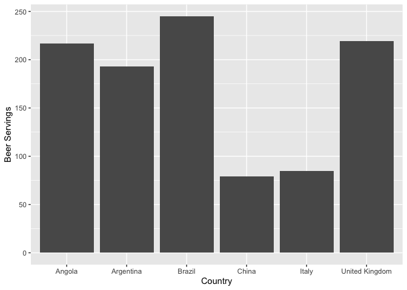

Beer Servings in Specific Countries
================

## Summary of Drinks Code

``` r
summary(drinks)
```

    ##    country          beer_servings   spirit_servings  wine_servings   
    ##  Length:193         Min.   :  0.0   Min.   :  0.00   Min.   :  0.00  
    ##  Class :character   1st Qu.: 20.0   1st Qu.:  4.00   1st Qu.:  1.00  
    ##  Mode  :character   Median : 76.0   Median : 56.00   Median :  8.00  
    ##                     Mean   :106.2   Mean   : 80.99   Mean   : 49.45  
    ##                     3rd Qu.:188.0   3rd Qu.:128.00   3rd Qu.: 59.00  
    ##                     Max.   :376.0   Max.   :438.00   Max.   :370.00  
    ##  total_litres_of_pure_alcohol
    ##  Min.   : 0.000              
    ##  1st Qu.: 1.300              
    ##  Median : 4.200              
    ##  Mean   : 4.717              
    ##  3rd Qu.: 7.200              
    ##  Max.   :14.400

## Beer Serving Plots

Plot for beer servings in Angola, Argentina, Brazil, China, Italy, and
the United Kingdom:

<!-- -->

Note that the `echo = FALSE` parameter was added to the code chunk to
prevent printing of the R code that generated the plot.
